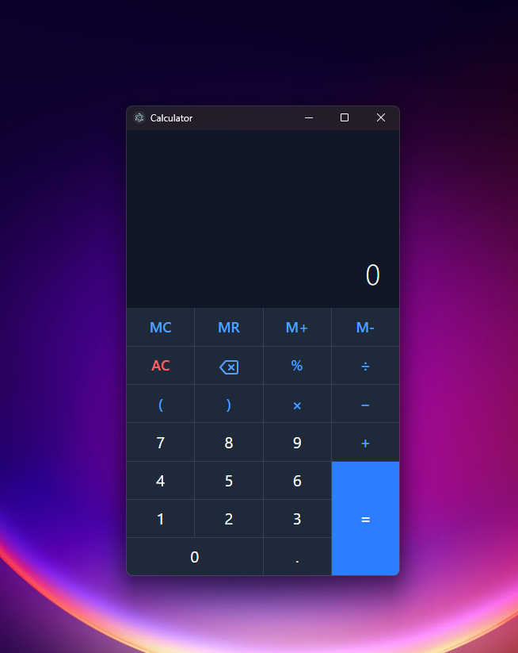

# Modern Calculator App

A sleek, modern calculator application built with Electron, React, and TypeScript. Features a responsive design that adapts to system theme preferences and provides both mouse and keyboard input support.

 <!-- You'll need to add this -->

## Features

- 🌓 Automatic dark/light theme switching based on system preferences
- ⌨️ Full keyboard support for quick calculations
- 📱 Responsive design that works across different window sizes
- 🔢 Basic arithmetic operations (+, -, ×, ÷)
- 🎯 Precise calculations using mathjs library
- 💫 Smooth animations and transitions
- 📳 Haptic feedback on calculations (on supported devices)

## Tech Stack

- **Framework**: Electron + React
- **Language**: TypeScript
- **Styling**: TailwindCSS
- **Math Processing**: mathjs
- **Build Tool**: Vite
- **Package Manager**: npm
- **Code Quality**: ESLint + Prettier

## Prerequisites

- Node.js (v14 or higher)
- npm (v6 or higher)

## Installation

1. Clone the repository:

```bash
git clone https://github.com/generyand/electron-calculator.git
cd electron-calculator
```

2. Install dependencies:

```bash
npm install
```

3. Start the application:

```bash
npm run dev
```

4. Build the application:

```bash
npm run build
```

## Debugging

The application includes VSCode launch configurations for debugging both the main and renderer processes. To start debugging:

1. Open the project in VSCode
2. Press F5 or select "Debug All" from the debug menu
3. The application will start with debugger attached

## Contributing

1. Fork the repository
2. Create your feature branch (`git checkout -b feature/AmazingFeature`)
3. Commit your changes (`git commit -m 'Add some AmazingFeature'`)
4. Push to the branch (`git push origin feature/AmazingFeature`)
5. Open a Pull Request

## License

This project is licensed under the MIT License - see the [LICENSE](LICENSE) file for details.

## Acknowledgments

- [Electron](https://www.electronjs.org/)
- [React](https://reactjs.org/)
- [TailwindCSS](https://tailwindcss.com/)
- [mathjs](https://mathjs.org/)
- [electron-vite](https://electron-vite.org/)

## Support

For support, please open an issue in the GitHub repository or contact the maintainers.